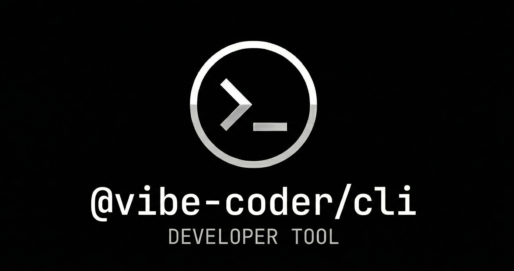

<div align="center">

  <a href="https://github.com/HelloGGX/vibe-coding-cli">
    
  </a>

   <p>
    <strong>专为 OpenCode 打造的 vibe coding 生态构建工具</strong>
   </p>

[](https://github.com/HelloGGX/vibe-coding-cli)
[](https://www.npmjs.com/package/@vibe-coder/cli)
[](../../LICENSE.md)
[](https://bun.sh)

  <p>
    <a href="https://github.com/HelloGGX/skill/blob/main/packages/vibe/README.md">English</a> · <b>简体中文</b>
  </p>
  <p>
    <em>"一键聚合 AI 工具与上下文规范，让 Agent 真正懂你的代码架构。"</em>
  </p>
</div>

## 📖 简介 (Introduction)

`@vibe-coder/cli` 是一个专为 **OpenCode** 平台打造的现代命令行脚手架工具。它的核心目标是快速搭建 Vibe Coding 的开发环境，简化规范驱动开发的资源管理。

通过 `vibe` 命令，你可以一键拉取远程 GitHub 仓库中的 TypeScript/Python 工具脚本或 Markdown 规则文件，自动无缝注册到 OpenCode 配置中，并接管底层运行依赖，让你专注于**“与 AI 共创代码”**本身。

## ✨ 核心特性 (Features)

- 🛠 **全自动化工具管理**: 支持从任意 GitHub 仓库快速解析、多选并下载 `.ts` / `.py` 脚本至本地开箱即用。
- 📜 **Context 与 Capabilities 完美融合**: 独创生态聚合能力，将 Agent 执行所需的**工具技能**与**行为准则**深度绑定。支持按需安装 `.md` 规则文件，让 AI 真正懂你的架构意图。
- 📦 **智能配置注入**: 自动拦截并更新 `.opencode/opencode.jsonc`，无感注入工具开关与 Prompt 指令路径，告别繁琐的手动配置。
- ⚡ **并行极速更新**: 基于并发模型设计，同时处理多个源仓库的资源对比与拉取，大幅缩短更新等待时间。
- 🪄 **标准技能聚合**: 与 Vercel 的 `pnpx skills` 生态深度集成，在统一的 CLI 流程中同时管理标准 Agent 技能库和本地扩展资源。

---

## 🚀 快速开始 (Quick Start)

### 环境要求 (Prerequisites)

- [Node.js](https://nodejs.org/) >= 18.0.0 或 [Bun](https://bun.sh/) >= 1.0.0

### 安装

作为全局包安装：

```bash
# 使用 npm
npm i -g @vibe-coder/cli

# 使用 bun
bun add -g @vibe-coder/cli
```

### 基础用法

初始化并添加一个生态库（例如本项目的 `helloggx/skill`）：

```bash
vibe add helloggx/skill
```

_CLI 将唤起交互式菜单，允许你灵活多选想要安装的 **Tools (工具)** 和 **Rules (规则)**，并自动为你完成所有环境配置。_

---

## 📚 命令指南 (Commands)

| 命令                 | 别名 | 功能描述                                                                         |
| -------------------- | ---- | -------------------------------------------------------------------------------- |
| `vibe add <repo>`    | `a`  | 解析目标 GitHub 仓库，唤起 UI 列表，按需安装工具和规则文件，并自动注入配置。     |
| `vibe list`          | `ls` | 清晰打印当前项目中所有已安装资源（本地工具、上下文规则、全局标准技能）的态势图。 |
| `vibe update`        | `up` | 一键并发拉取 `vibe-lock.json` 中的所有源仓库，智能比对并覆盖本地脚本与规则。     |
| `vibe remove [资源]` | `rm` | **无参运行**：唤起 UI 多选列表删除本地项。<br>                                   |

<br>**带参运行**：快捷匹配并移除指定的标准技能或本地工具，并同步清理配置。 |

---

## 🏗️ 构建你自己的资源仓库

我们强烈鼓励你或团队在 GitHub 上创建专属的 Vibe Coding 资源仓库，以在所有项目中标准化团队最喜欢的 AI 工具和自定义编码规范。

### 推荐目录结构

为确保与 `@vibe-coder/cli` 完美兼容，推荐采用以下约定（可参考 `helloggx/skill`）：

```text
your-custom-repo/
├── skill/                  # (可选) 标准的 Vercel AI Agent 技能库
├── tool/                   # 自定义 TS/Python 可执行工具
│   ├── get_dsl.ts
│   ├── get_dsl.py          # 💡 Python 脚本应与其调用的 TS 工具同名
│   └── shadcn_vue_init.ts
└── rules/                  # 个性化 Markdown 上下文规则
    ├── common/             # 适用于所有项目的全局通用规则
    │   ├── coding-style.md
    │   └── security.md
    └── typescript/         # 特定技术栈规则
        └── coding-style.md # 💡 建议与被扩展的通用规则同名
```

### 组织最佳实践

- **跨语言工具联动**：若你的 `.ts` 工具依赖底层的 `.py` 脚本，**请确保两文件基础名称完全一致**（如 `get_dsl.ts` 和 `get_dsl.py`）。CLI 会智能识别并一并拉取。
- **规则继承与扩展**：
- 全局通用规则务必放在 `rules/common/` 下。
- 为特定技术栈编写规则时（如 `rules/typescript/`），若需继承 `common` 规则，建议**保持同名**，并在文件顶部显式声明继承关系：
  _> 此文件扩展了 [common/coding-style.md](https://www.google.com/search?q=../common/coding-style.md) 并增加了 TS 特定内容。_

---

## 📂 目录与配置规范 (Workspace Structure)

运行 `vibe add` 后，工具将在项目根目录自动接管并维护以下结构：

```text
your-project/
├── .opencode/
│   ├── tool/                   # 底层 .ts / .py 工具脚本
│   ├── rules/                  # .md 规则文件（按类别归档）
│   ├── opencode.jsonc          # OpenCode 核心配置（CLI 自动注入工具开关与指令路径）
│   └── vibe-lock.json          # 状态锁文件，精准记录资源来源与版本
├── .venv/                      # (按需自动创建) 隔离的 Python 虚拟环境
└── requirements.txt            # (按需自动维护) Python 脚本依赖清单
```

---

## 🤝 融入生态 (Join the Ecosystem)

如果你的开源项目（如 Agent Skills、Tools 或 Rules）兼容并使用了 vibe-coding 规范，欢迎在你的 `README.md` 中挂上这枚专属徽章，向社区展示你的前卫品味！

复制以下 Markdown 代码即可添加到你的项目中：

```markdown
[](https://github.com/HelloGGX/vibe-coding-cli)
```

(挂上徽章后，你将有机会被收录进官方的名人堂精选列表！)

## 🛠️ 开发者指南 (Development)

本项目基于极速的 [Bun](https://bun.sh/) 运行时构建。

```bash
bun install             # 1. 安装依赖
bun run dev --help      # 2. 本地调试
bun run typecheck       # 3. 类型检查
bun run build           # 4. 构建生产版本 (输出至 ./dist)
```

## 📄 许可证 (License)

[MIT License](https://www.google.com/search?q=../../LICENSE.md) © 2026 [HelloGGX](https://github.com/HelloGGX)
